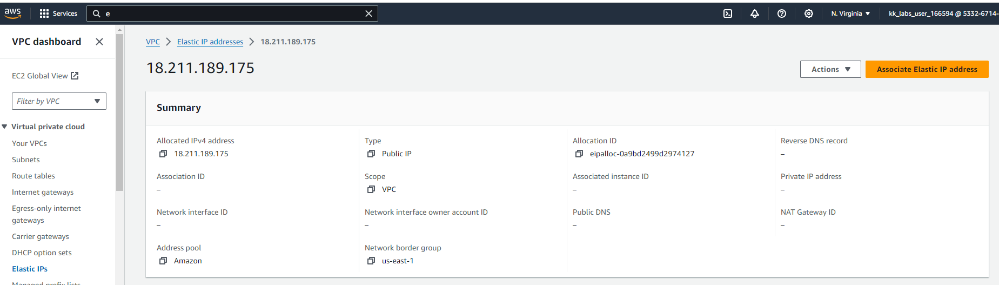
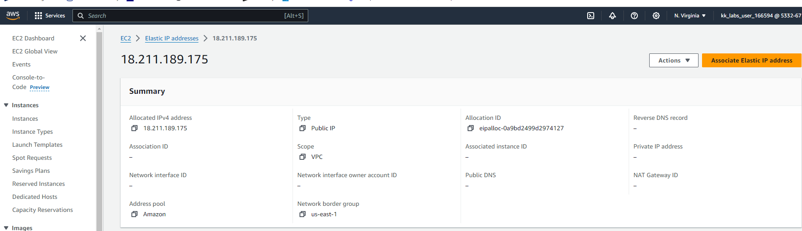

_The Nautilus DevOps team is strategizing the migration of a portion of their infrastructure to the AWS cloud. Recognizing the scale of this undertaking, they have opted to approach the migration in incremental steps rather than as a single massive transition. To achieve this, they have segmented large tasks into smaller, more manageable units. This granular approach enables the team to execute the migration in gradual phases, ensuring smoother implementation and minimizing disruption to ongoing operations. By breaking down the migration into smaller tasks, the Nautilus DevOps team can systematically progress through each stage, allowing for better control, risk mitigation, and optimization of resources throughout the migration process._    

_For this task, allocate an Elastic IP address, name it as nautilus-eip._    

# Solution  
~ on ☁️  (us-east-1) ✖ **aws ec2 describe-addresses**  
{
    "Addresses": []
}  

~ on ☁️  (us-east-1) ✖ **aws ec2 allocate-address --tag-specifications "ResourceType=elastic-ip,Tags=[{Key=Name,Value=nautilus-eip}]"**  
{
    "PublicIp": "18.211.189.175",
    "AllocationId": "eipalloc-0a9bd2499d2974127",
    "PublicIpv4Pool": "amazon",
    "NetworkBorderGroup": "us-east-1",
    "Domain": "vpc"
}  
 
~ on ☁️  (us-east-1) ➜  **aws ec2 describe-addresses**  
{
    "Addresses": [
        {
            "PublicIp": "18.211.189.175",
            "AllocationId": "eipalloc-0a9bd2499d2974127",
            "Domain": "vpc",
            "Tags": [
                {
                    "Key": "Name",
                    "Value": "nautilus-eip"
                }
            ],
            "PublicIpv4Pool": "amazon",
            "NetworkBorderGroup": "us-east-1"
        }
    ]
}  

**AWS CONSOLE**  
        
      

